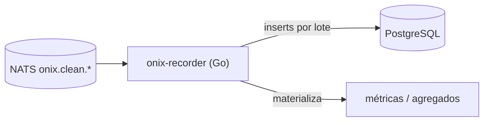

# onix-recorder

Servicio de **persistencia** de OnixGuard. Escrito en **Go**. Consume `onix.clean.*` y escribe en **PostgreSQL** (inserts por lote). También materializa métricas/agregados.

> **Estado:** se construye en **Fase 1–2**. En Fase 1 va combinado con el ingestor (consume `raw` directo); en Fase 2 se separa y consume `clean`. Este README documenta su diseño.

---

## Responsabilidad



Entrada `CleanEvent` (`onix.clean.*`) → **Postgres** (tablas del esquema de `onix-db`).

## Qué hará

- Consume `CleanEvent` de NATS/JetStream (consumidor durable) y hace **inserts por lote** en `events`, `tool_calls`, `credentials_detected`, `alerts`.
- **Auto-registro:** en `session_start` crea/actualiza el `agent` y la `session` (sin registro manual).
- Materializa **agregados** por etapa/agente para el header y los reportes.
- **Back-pressure:** JetStream + batching para absorber picos de muchos hooks/seg.

## Contratos

- **Consume:** `CleanEvent` (`onix.clean.*`). En Fase 1, `RawEvent` (`onix.raw.*`) directo.
- **Escribe:** esquema de `onix-db` (Postgres externo, vía `DATABASE_URL`).
- **Importa:** `github.com/levapo97-cell/onix-contracts/go/onixcontracts`.

## Estructura (futura)

```text
cmd/onix-recorder/main.go
internal/nats/    internal/store/ (Postgres)
Dockerfile        # multi-stage (golang → distroless)
```

---

*Parte de OnixGuard. Ver el plan en `OnixGuard/docs/PLAN.md` §1, §3 (esquema) y §13 (fases).*
